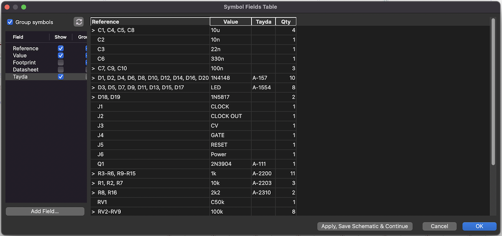

# Kicad Tayda Quick Order BOM

A KiCad BOM generator to generate a csv that can be imported into the [Tayda quick order](https://www.taydaelectronics.com/quick-order/).

For this to work you will need to add a custom field to you components named "Tayda". I find the easiest way to do this is once the schematic is finished to use the bulk edit fields tool.

Add a new field "Tayda" (capital T) then for each component enter the appropriate Tayda part number. E.g. A-037 is a TL072 op amp.

The export will group on the Tayda part number, no other values are taken into account. Any part with a part number will be grouped and counted together.

Any component that does not have an entry in the Tayda field will be ignored and left out of the export.

## Resistors
As resistors come in quantities of 10 the export calculates the minimum multiple of 10 that gives you required amount.

This is currently reasonably primitive: if the part name is R (ie the standard resistor) it will do the calculation. If there is a desire this can be made more fully featured.

## Acknowledgements
kicad_netlist_reader.py included under GPL-3.0 license
https://github.com/janelia-pypi/kicad_netlist_reader
